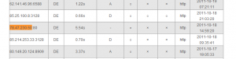

A couple weeks ago I was messing with a few Apache configs, trying a few things that could improve the server performance. Everything was fine until late last week when I noticed that the page was really slow. Initially I thought it was a connectivity issue but after a couple hours I decided to troubleshoot it. First thing to do is check the logs for any possible explanation. Found two interesting messages:

`[error] server reached MaxClients setting, consider raising the MaxClients setting`

That is interesting specially because I tweaked the MaxClients setting not too long ago and the traffic has not increased significantly since then. The second interesting information was the number of GETs to external domains. That can't be right. Why users would be requesting pages from other domains?

First thing a thought was 'Damn, I'm serving as an open proxy!', and I was right! Went to check the Apache configs and found:

`ProxyRequests On`

ProxyRequests was set to On, meaning that Apache was serving as an open proxy.

Second thing I went to check was the server statistics. Interestingly 3 days ago the memory usage increased significantly and and also the bandwidth utilization. More memory was coming from more Apache processes, showing exactly when it started. But how I started to get so many requests so quickly? Goggled it. My IP was listed on several open proxy lists, containing even the status, latency and even the last check time. That is awesome! Probably they have bots port scanning all around. One of these bots found my IP and published it somewhere and this list was replicated and replicated from here to Japan!

Obviously I don't want to be serving as and open proxy for several reasons, so I went and changed the `ProxyRequests` back to `Off`. Right after I changed it, I saw the logs growing enormously. That's when I noticed the extent of the problem. I was serving hundreds of concurrent users, a pretty good burn test for the server. And guess what, after days like that, it was still rock solid!

Now the second part of the saga. After turning `ProxyRequests` back to `Off`, besides the huge increase on logging (error only), CPU spiked to a load average of 22 on a 4 proc server. That's a lot for those not familiar with Linux. An increase on logging is expected, since we're having far more errors now, were users requests for other domains are failing. An increase on CPU usage was also expected, since the number of requests to my main page increased significantly (failed proxy requests are redirected to the default Apache site), but not as much as 22.

Checking the logs again I've noticed a huge number of errors stating that the URL was too long. All of these 'long' URLs had the same format, an external domain, followed by 'http' in a loop, like 'http://www.google.com/httphttphttphttphttphttphttphttphttphttp...'. That was strange, why would someone requests a website like this. Then I decided to try using my server as a proxy. The same thing happened, tried google.com and I was being automatically got to a redirect loop that and appending 'http' to my requests until reaching a limit of 20 or so redirects. This means that every proxy request by users was generating over 20 requests on my server. Next step is to check why that was happening. Time to 'telnet' my server on port 80:

`GET http://www.google.com/ HTTP/1.1 Host:www.google.com`

That returned and HTTP 301 (Moved Permanently) response, moving to the same domain, but appending 'http' to the address. Good, same behavior we had on the browser. Now why is this happening. Looking a little bit further into this, I've found that when Apache gets a request for a domain that not in your virtual host list, it responds with the default virtual host, or the first virtual host loaded if you have not defined that explicitly. My default virtual host is my main website, a Wordpress based site. Analyzing this further, I've found that when Wordpress receives a request for an unknown page, it redirects to a standard page, instead of returning an HTTP 404 (Not Found) error. That is called canonical URL redirection and is used for a number of reasons, from enabling alternative URLs to 'fancy' permalinks. That explains the loop. Apache opens the default website with Wordpress, which redirects automatically to the same non existent domain, just appending the requested page to the address. Since the ':' char is not valid in an address, Wordpress stops there. Since the user still has my server set as proxy, the process starts again, but that time with an extra 'http', and so on, on a infinite loop. So how do we disable that??

Found a simple how-to at [velvetblues.com](http://www.velvetblues.com/web-development-blog/turn-off-wordpress-homepage-url-redirection/ "velvetblues.com"). You simply have to add the following line to your templates 'functions.php':

`remove_filter('template_redirect','redirect_canonical');`

Tried that and it worked! Now when I try to use my Apache server as proxy, all requests return a Wordpress page mentioning that the page was not found. Problem solved!

...

Not so much, we still have the part three of the saga. I waited a few minutes and checked the server statistics again. CPU usage reduced significantly, to a load average of 5. Still a lot, but much better than 22 we had before. Server was responding quickly, but I'm still not satisfied. I don't like the fact that a lot of leechers are consuming a lot of resources on my server. How can I improve that assuming that leechers will keep trying to access my server as a proxy for a while before figuring out it is working anymore. To solve this we have plenty of options, from simple ones to more complex ones like adding modules to Apache to 'iptables' block users that try to request domains that are not on the virtual hosts list. I don't want to waste too much time on this since it's not critical, so I opted for a very simple solution. Dynamic pages are very resource intensive compared to static pages. I don't really care about serving a 'nice' page to users that trying to use my server as a proxy. So why not show these users a simple html page instead of my Wordpress website? Well, Apache serves the default website to virtual hosts not matching any virtual host on the list, so I decided to simply change the default website to the default and well known Apache page 'It Works!'. To do so, I just had to enable the default Apache site that was already there, just not enabled.

Guess what?? It worked. Requests to non-mapped domains were being served with a simple 'It Works!' page. Waited for a few minutes and checked the server statistics again, and wow, load average went to 0.1. Problem solved. Serving simple static pages reduced the CPU usage drastically. Now I just have to deal with the error log file.

That was easy, since now all 'undesired' users were being 'redirected' to the default Apache website, it was just a matter of changing the error log level. Just went and changed the following line on the default configuration:

`LogLevel crit`

This will only log critical errors, which are not the errors we're having now, solving the log file issue. Ohh, just remember to comment the `CustomLog` line too, to avoid access logging, which is even worse.

Cheers, Martin
